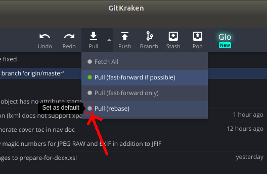

Produksjonssystem
=================

Python-skript for å sette opp et produksjonssystem
basert på overvåking av mapper og automatiske
konverteringer.


## Øvrig dokumentasjon

- [Oppdater metadata](docs/update-metadata/README.md)
- [Lag innlesingsklar EPUB fra NLBPUB](docs/nlbpub-to-narration-epub/README.md)

## Utviklingsmiljø

Valgfritt, men anbefaler:

- [GitKraken](https://www.gitkraken.com/) med GitHub-innlogging
- Lag en snarvei til bokarkivet på skrivebordet: `ln --symbolic /tmp/book-archive /home/$USER/Desktop/book-archive`
- [oXygen](https://www.oxygenxml.com/) for XML-filer
- For eksempel [atom.io](https://atom.io/) for redigering av Python-filer

På "master"-grenen i git vil vi unngå merge commits. Dette er for å holde historikken ren og oversiktlig. Sett derfor opp git til å bruke "rebase" istedenfor "merge" når man gjør en "pull".

Fra kommandolinja, skriv følgende for å sette "rebase" som standard for "git pull":

```bash
git config --global pull.rebase true
```

I GitKraken, trykk på pilen ved siden av "Pull", og trykk deretter på den lille rundingen ved siden av "Pull (rebase)".



I Atom bør man bruke Pylama. Installer pakken `linter-pylama` i Atom. Under Settings - Packages - Linter Pylama,
bruk "internal"-versjon, sett interpreter til "python3", bruk "Use pylama config" for konfigurasjonsfil, og ignorer
gjerne feilmeldingskodene "D203,D212,D213,D404".

## Installasjon

- Hvis ikke mappen `Desktop` finnes i hjemmemappen, men f.eks. `Skrivebord`, så er det praktisk å lage en symlink, for eksempel:
    ```
    ln --symbolic $HOME/Skrivebord $HOME/Desktop
    ```

- installer java 8 JDK: `sudo apt install openjdk-8-jdk`
    - sett JAVA_HOME i `~/.bashrc` (eller `~/.zshrc` hvis du bruker zsh):
        ```
        export JAVA_HOME="/usr/lib/jvm/java-8-openjdk-amd64"
        ```

- installer DAISY Pipeline 2
    - Lokal instans:
        - Kopier Pipeline 2 fra: `NLB-Teknologiavdelingen > Delte dokumenter > IKT > Programmer > DAISY Pipeline > daisy-pipeline2-1.11.tar.gz` og pakk ut til `~/Desktop/daisy-pipeline2`
    - Ekstern(e) instans(er) (kjørende på annen PC/server):
        - Sett opp `REMOTE_PIPELINE2_WS_*`-miljøvariablene. Se `set-test-env.sh.example` for eksempel.

- installer DAISY Pipeline 1
    - Last ned "Pipeline 1 Command Line Tool" via https://daisy.org/activities/software/pipeline-1/download-and-installation-2/
    - Unzip som /opt/pipeline1 (eller sett `PIPELINE1_HOME` om du vil ha den et annet sted)

- installer ACE:
    - `sudo apt-get install -y build-essential`
    - `curl -sL https://deb.nodesource.com/setup_13.x | sudo -E bash -`
    - `sudo apt-get install nodejs`
    - `sudo PUPPETEER_SKIP_CHROMIUM_DOWNLOAD=true npm install @daisy/ace -g`

- installer Calibre v4.10:
    - `sudo -v && wget -nv -O- https://download.calibre-ebook.com/linux-installer.sh | sudo sh /dev/stdin`
    - `sudo apt-get install ttf-mscorefonts-installer` (blant annet for "Verdana"-fonten)

- installer epubcheck:
    - Last ned EPUBCheck herifra: https://github.com/w3c/epubcheck/releases (i utgangspunktet bruker vi 4.2.2, som er nyeste versjon per 19.november 2019)
    - pakk ut i en mappe, for eksempel `~/Desktop/epubcheck/` eller `/opt/epubcheck/`, og sett miljøvariabelen `EPUBCHECK_HOME` i `~/.bashrc` (evt. `.zshrc` hvis du bruker zsh): f.eks. `export EPUBCHECK_HOME="/opt/epubcheck"`

- installer og konfigurer quickbase-dump-skript:
    - kopier miljøvariabler fra LastPass (søk etter "Quickbase-miljøvariabler") og legg dem inn i slutten av `~/.bashrc` (evt. `~/.zhrc` hvis du bruker zsh)
    - åpne ny terminal, eller `source ~/.bashrc`
    - `sudo apt install git maven`
    - `sudo mkdir /opt/quickbase`
    - `sudo chown $USER:$USER /opt/quickbase`
    - last ned https://github.com/nlbdev/ansible/blob/master/src/quickbase/get-latest.sh til `/opt/quickbase/get-latest.sh`
    - `chmod +x /opt/quickbase/get-latest.sh`
    - Valgfritt: kjør `/opt/quickbase/get-latest.sh` i en terminal

- installer produksjonssystem:
    - klon git repository, enten via GitKraken, eller via kommandolinja (`https://github.com/nlbdev/produksjonssystem`)
    - `sudo apt install software-properties-common -y`
    - `sudo add-apt-repository ppa:deadsnakes/ppa -y`
    - `sudo apt update`
    - `sudo apt install python3.7 python3.7-distutils python3.7-dev python3-pip python3-apt`
    - `sudo apt install graphviz`  # for plotting
    - `sudo apt install ffmpeg libavcodec-extra`  # for lydutdrag
    - `sudo apt install libxml2-dev libxslt1-dev`  # for lxml i Python
    - `pip install virtualenv`  # for å kjøre produksjonssystemet med Python 3.7 på nyere PCer
    - `source prodsys-virtualenv/bin/activate`  # for å bytte til Python 3.7
    - `pip install -r requirements.txt`

- konfigurer Slack
    - I `~/.bashrc` (evt. `.zshrc` hvis du bruker zsh), sett miljøvariabelen `SLACK_BOT_TOKEN`. Se "Slack bot" i LastPass.

- konfigurer NLBs API
    - I `~/.bashrc` (evt. `.zshrc` hvis du bruker zsh), sett miljøvariabelen `NLB_API_URL`:
        ```
        export NLB_API_URL="https://api.dev.nlb.no/v1"
        ```

## Kjør produksjonssystem

- for å oppdatere quickbase-database (gjør innimellom, eller etter behov for nyere bøker):
    - `/opt/quickbase/get-latest.sh`
- `cd ~/nlb/produksjonssystem` (eventuelt hold musa over "produksjonssystem" øverst til venstre i GitKraken for å se hvor du har lagret produksjonssystemet)
- For å kjøre tester:
  - `./test.sh`
- For å starte produksjonssystemet:
  - sett miljøvariabler i terminalen for testing: `source set-test-env.sh` (hvis du vil så kan du legge til dette i `.bashrc`, så slipper du å skrive det hver gang)
    - `set-test-env.sh` definerer blant annet at bokarkivet skal ligge i en midlertidig mappe kalt `/tmp/book-archive`.
      En liste med lenke til dashboard'et samt bokarkiv-mappene som brukes, vises i terminalvinduet når man starter produksjonssystemet.
  - start systemet: `./run.sh`
  - stopp systemet: CTRL+C eller `touch /tmp/trigger-produksjonssystem/stop`

## Endre innstillinger for e-postvarsling

### Endre e-post instillinger

E-postadresser defineres i 'produksjonssystem.yaml' (definert med miljøvariabelen `CONFIG_FILE` i `set-test-env.sh`):

- Legg til eller fjern e-post til pipeline
```yaml
nordic-epub-to-nlbpub:
  - Kaptein.Kode@nb.no
```
## Lage en ny pipeline

### Definer pipeline i `run.py`

Definer en ny mappe sammen med de andre mappene, og definer en ny pipeline sammen med de andre pipeline'ene, og sett riktig inn-/ut-mappe.

**`produksjonssystem/run.py`**
```python
dirs = {
    #...
    "format": os.path.join(book_archive_dir, "distribusjonsformater/Format")
}

pipelines = [
    #...
    [ NlbpubToFormat(), "nlbpub", "format", "reports"],
```

### Implementer pipeline

Lag en ny Python-fil for pipeline'en i mappen "produksjonssystem". Ta gjerne utgangspunkt i en annen eksisterende pipeline, eller følg den følgende malen:

**`produksjonssystem/nlbpub_to_format.py`**
```python
#!/usr/bin/env python3
# -*- coding: utf-8 -*-

import sys

from core.pipeline import Pipeline

if sys.version_info[0] != 3 or sys.version_info[1] < 5:
    print("# This script requires Python version 3.5+")
    sys.exit(1)

class NlbpubToFormat(Pipeline):
    uid = "..."
    title = "..."

    def on_book_deleted(self):
        pass

    def on_book_modified(self):
        pass

    def on_book_created(self):
        pass


if __name__ == "__main__":
    NlbpubToFormat().run()

```

## Teste system

For å kjøre alle testene:

```
./test.sh
```

Eventuelt kan man teste hele systemet, kjøre alle XSpec-testene, eller alle Python unit test'ene som følger:

```
./test_system.py
./test_xspec.py
./test_unit.py
```

Format og metode i Bibliofil
----------------------------

TODO: denne dokumentasjonen hører ikke hjemme i produksjonssystemet. Flytt den til et mer passende sted.

Bibliofil sender `deliveryFormat` til distribusjonssystemet vårt. Feltet har formen `{format}_{metode}`. Vi oppgir format og metode når bøker er ferdig produsert i produksjonssystemet (gjennom "formatklar"-e-post), og kan dermed styre selv hvilke formater og metoder som finnes. Bibliotek-Systemer må legge til støtte for hver metode, ettersom de oppfører seg forskjellig, men format og navn kan vi styre helt selv.

formater (id - navn):
- daisy - "DAISY 2.02"
- epub - "EPUB"
- docx - "DOCX (Word)"
- mobi - "Mobi / Kindle Format"
- html - "HTML"

metoder (id - navn):
- cd - "CD"
- dl - "Last ned"
- st - "Vis i nettleseren"
- ki - "Send til Kindle"
- no - "Legg på bokhylla" - utfører lånet, men har ingen "metode" (no=none), så ingenting skjer utover at boken legges på bokhylla. Tilsvarer dagens "Til Lydhør/online-spiller".

E-post sendes til Bibliofil, på formen:

```
{boknummer};{format-id};{metode-id};{navn}
```

(For nedlasting, altså metode-id=dl, så brukes format-navn som navn, ellers brukes metode-navn.)


For eksempel:

```
321654;epub;dl;EPUB
321654;html;dl;HTML
321654;docx;dl;DOCX (Word)
321654;mobi;ki;Send til Kindle
321654;epub;un;Legg på bokhylla
```
