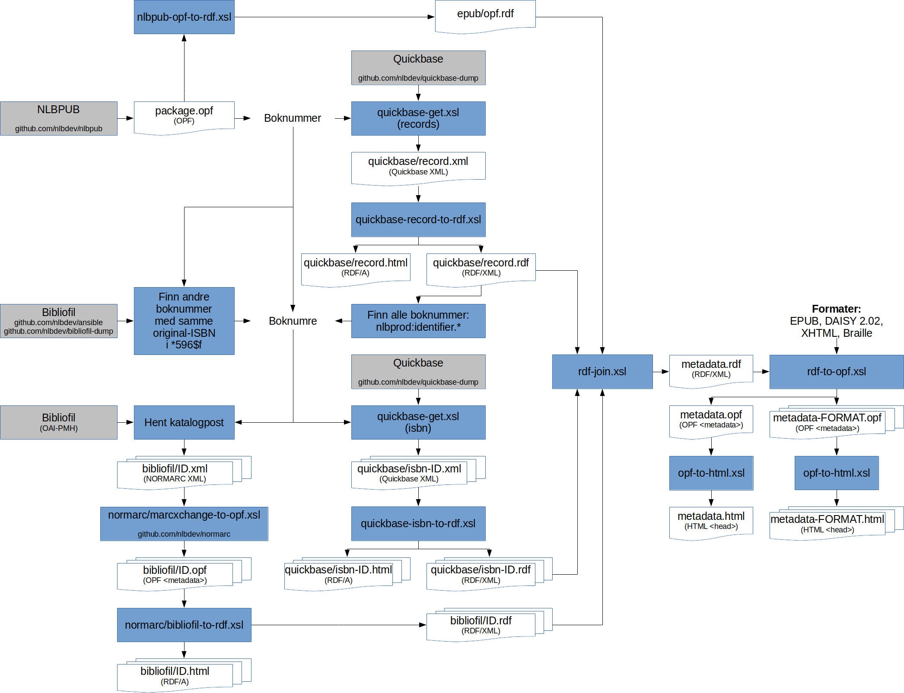

Oppdater metadata
=================

Dette steget:
- sammenstiller metadata fra EPUBen, fra Bibliofil, og fra Quickbase
- validerer metadata, og sender e-post til bibliotekarer dersom det er katalogiseringsfeil
- setter inn metadata i EPUBen etter behov (funksjon som kan brukes av andre steg)
- henter oppdatert metadata for alle bøker i ut-mappen (dvs. NLBPUB) med jevne mellomrom, og validerer disse

Det følgende diagrammet gir en oversikt over hvordan metadata flyter gjennom dette steget:

